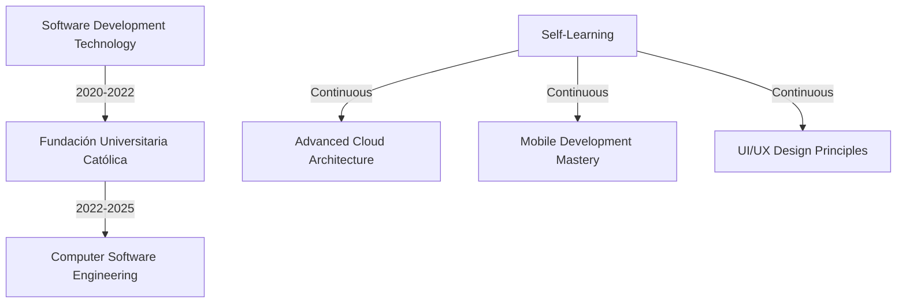

  
# ✨ Jaider Panqueva ✨
  

  
  
  
  

## 🧙‍♂️ About Me

> *"It's not our abilities that show what we truly are... it's our choices"* - Albus Dumbledore

I'm a passionate Full Stack Developer who transforms complex problems into elegant, user-friendly solutions. Currently enchanting code at **AlleyCorp Sur** as a Software Engineer II, where I specialize in creating cross-platform mobile applications and robust cloud architectures.

With a background in both frontend and backend technologies, I thrive in dynamic environments where innovation and technical excellence are valued. My approach combines creative problem-solving with disciplined engineering practices to deliver exceptional digital experiences.

## 🚀 What I Do

- **Develop** scalable applications with React, React Native, and Node.js
- **Design** efficient cloud infrastructures on AWS and GCP
- **Optimize** performance through thoughtful architecture and code refinement
- **Mentor** junior developers to elevate team capabilities
- **Collaborate** across disciplines to deliver cohesive products

## 🏆 Professional Achievements

- 🌟 Reduced mobile development costs by 35% through implementing cross-platform React Native solutions
- 🎯 Improved system reliability with microservices architecture, achieving 99.9% uptime (20% improvement)
- 🚀 Enhanced API response times by 60% through backend optimization and caching strategies
- 📈 Spearheaded migration to TypeScript, reducing production bugs by 40%
- 👨‍💻 Led a team of 5 developers to deliver a critical product release ahead of schedule

## 💼 Featured Projects

<table>
  <tr>
    <td width="50%">
      <h3 align="center">E-Commerce Platform</h3>
      

        
        
      

      
<strong>React • Node.js • MongoDB • AWS</strong> - Full-stack e-commerce solution with real-time inventory management and personalized recommendations.

    </td>
    <td width="50%">
      <h3 align="center">Health Tracking Mobile App</h3>
      

        
        
      

      
<strong>React Native • Firebase • FastAPI</strong> - Cross-platform health tracking application with real-time data synchronization and analytics dashboard.

    </td>
  </tr>
</table>

## ⚡ Tech Arsenal

  <h3>Frontend</h3>
  

    
    
    
    
    
    
  

  
  <h3>Backend</h3>
  

    
    
    
    
    
    
  

  
  <h3>Cloud & DevOps</h3>
  

    
    
    
    
    
    
  

## 📈 GitHub Analytics

  
  

  

## 🎓 Educational Journey

## 🌍 Languages

- 🇺🇸 English (Professional Working)
- 🇫🇷 French (Professional Working)
- 🇪🇸 Spanish (Native)

## 📫 Let's Connect!

I'm always interested in challenging projects and opportunities to collaborate with fellow developers. Whether you have a question or just want to say hi, feel free to reach out!

  

