  
# ✨ Jaider Panqueva ✨
  

  
  
  

## 🧙‍♂️ About Me

> *"It's not our abilities that show what we truly are... it's our choices"* - Albus Dumbledore

I'm a passionate Full Stack Developer who believes in crafting magical digital experiences. Currently enchanting code at AlleyCorp Sur as a Software Engineer II, where I transform complex problems into elegant solutions.

## 🪄 Professional Highlights

- 🌟 Reduced development costs through cross-platform mobile solutions
- 🎯 Improved system uptime by 20% with microservices architecture
- 🚀 Enhanced API response times with optimized backend design
- 📚 Mentored junior developers and led successful development teams

## ⚡ Tech Arsenal

| Frontend | Backend | Cloud & DevOps |
|:--------:|:-------:|:--------------:|
|  |  |  |
|  |  |  |
|  |  |  |

## 📈 GitHub Analytics

  

## 🎓 Educational Journey

```mermaid
graph LR
    A[Software Development Technology] -->|2020-2022| B[Fundación Universitaria Católica]
    B -->|2022-2025| C[Computer Software Engineering]
```

## 🌍 Languages

- 🇺🇸 English (Professional Working)
- 🇫🇷 French (Professional Working)
- 🇪🇸 Spanish (Native)

## ⭐️ Favorite Quote

> *"Happiness can be found even in the darkest of times if one only remembers to turn on the light."*

---

